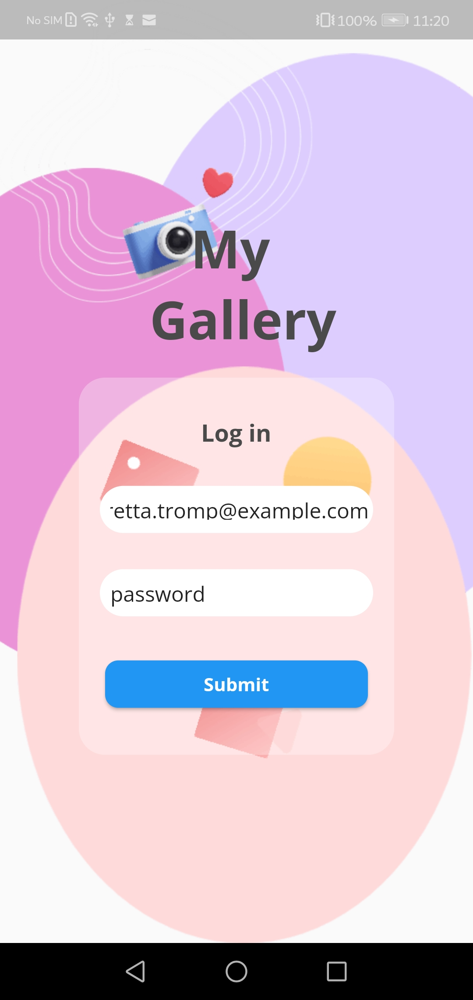
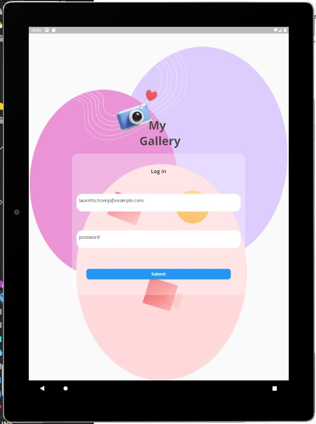
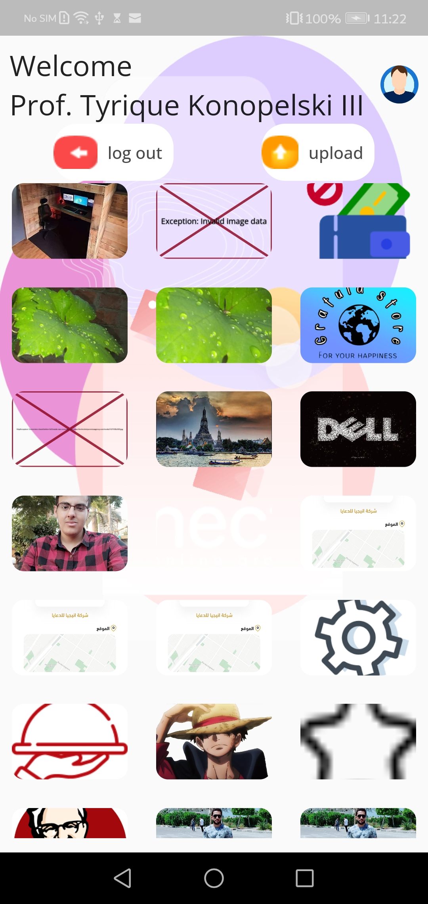
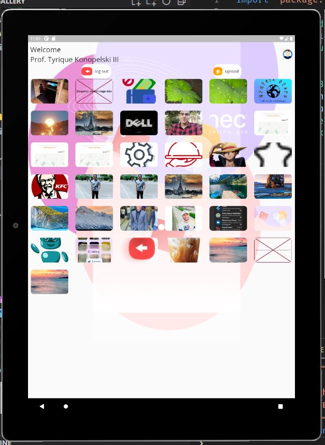
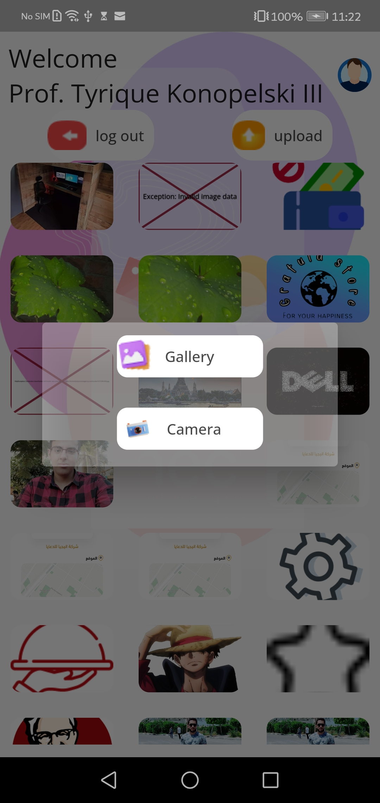
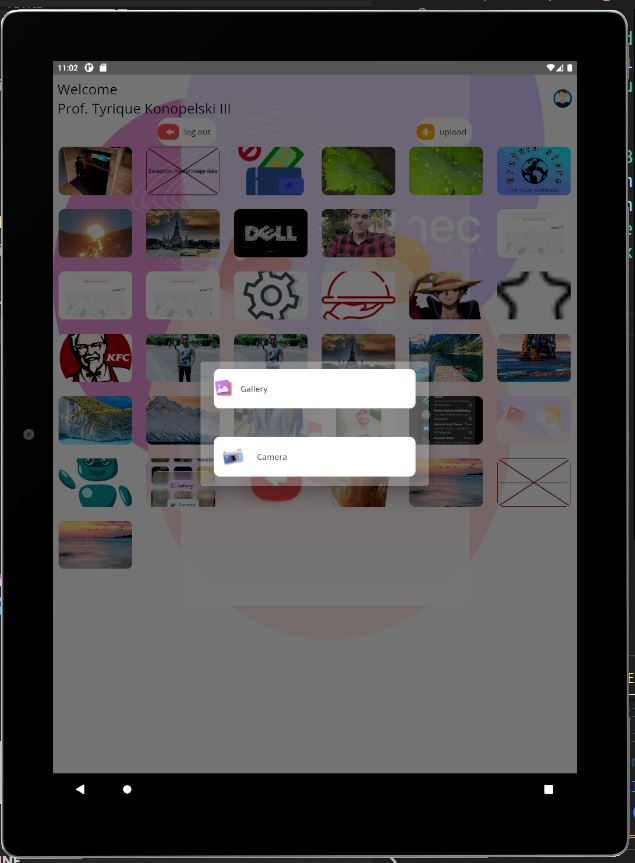

# My_Gallery
It is a place where users can view and upload there photos

## Table of contents
* [General info](#general-info)
* [Demo](#demo)
* [Technologies](#technologies)
* [How to use](#how-to-use)
* [Project Structure](#project-structure)
* [APK path](#apk-path)

## General info
This is an application named my gallery.The idea of this application is to help people in logging in for whether uploading or viewing their images.

### Demo
 * Video


https://user-images.githubusercontent.com/72389122/199860080-a42ffcfb-3c18-417d-88c5-43135ca7e1de.mp4


* Images
<table>
  <tr>
    <td>Log in Page on phone</td>
     <td>Log in Page on tablet</td>
  </tr>
  <tr>
    <td></td>
    <td></td>
  </tr>
  <tr>
    <td>Home page oon phone</td>
     <td>Home page oon tablet</td>
  </tr>
  <tr>
    <td></td>
    <td>
  </tr>
  <tr>
    <td>Upload page on phone</td>
     <td>Upload page on tablet</td>
    <td>After pressing on upload gallery</td>
  </tr>
  <tr>
    <td></td>
    <td></td>
   <td></td>
  </tr>
 </table>


## Technologies
Project is created with:
* Flutter version: 3.3.2
* flutter_bloc: 8.1.1
* dio: 4.0.6
* shared_preferences: 2.0.15
* conditional_builder_null_safety: 0.0.6
* image_picker: 0.8.6

	
## How to use
#### Step1: you need to download or clone this repo
```
git clone https://github.com/SeifNagi/my_gallery.git
```
#### Step2: you need to get all dependencies
```
flutter pub get
```
#### Step 3: run the project
```
flutter run lib/main.dart
```
## Project Structure
```
my_gallery/
├── assets/
|   ├── login/
|   └── my_gallery/
|
├── fonts/
|   └── Open_Sans/
|
├── lib/
│   ├── bloc/
│   │   ├── login
│   │   └── mygallery
│   ├── data/
│   │   ├── model/
|   |   |   ├── login_model
│   │   |   └── mygallery_model
|   |   ├── network
|   |   |   ├── dio_helper.dart
|   |   └── endpoints.dart
│   └── presentation/
|       ├── componenents/
|       |   ├── login 
│       │   └── mygallery
│       ├── page/
│       │   ├── login_screen 
│       │   └── gallery_screen
│       └──  styles/ 
└────── shared/
        ├── sharedprefrences
        └── widgets
```
### APK path
build\app\outputs\bundle\release\app-release.aab
